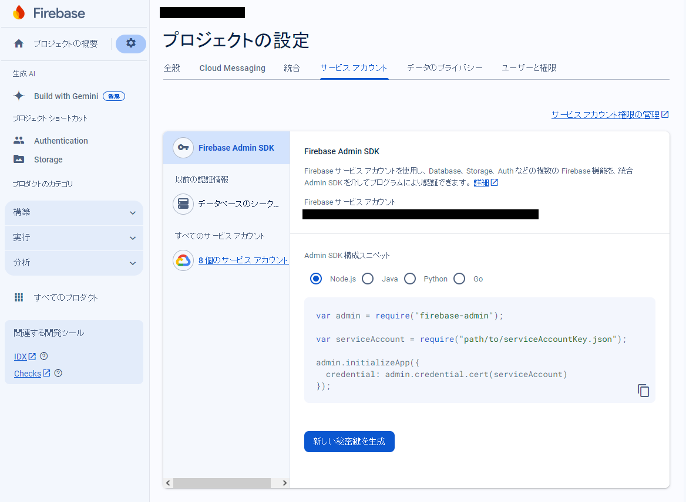

# Firebase Storage

## 設定

1. Firebase コンソールから「プロジェクトの設定 (歯車アイコン)」→「サービスアカウント」→「新しい秘密鍵を生成」で json ファイルをダウンロード。

    

2. Firebase Storage サービスからバケットを作成。
3. SDK 経由で、Firebase Storage にアクセス。

## 備考

- Firebase Storage の location は asia-northeast1 (東京) を推奨。