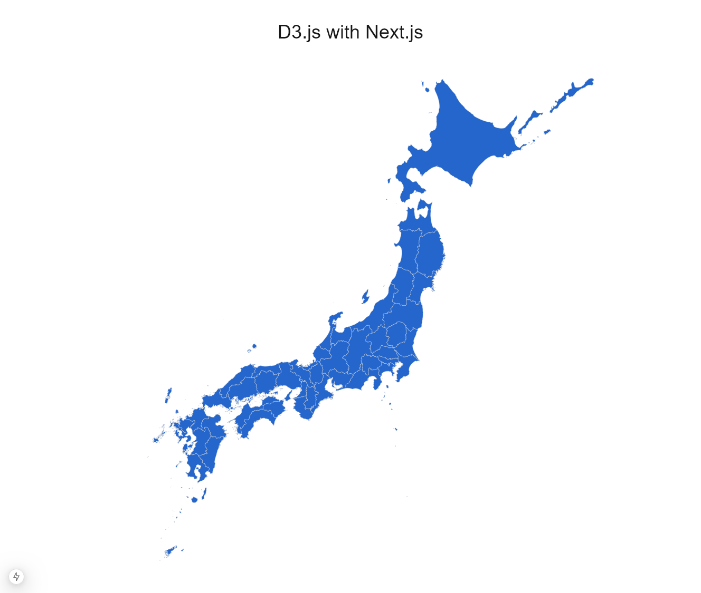

# D3.js with Next.js

## 概要

- D3.js を使って Next.js 上で日本地図を表示するサンプルリポジトリ
- D3.js（Data-Driven Documents）は、データを動的に視覚化するための JavaScript ライブラリ
- 画像は SVG 形式で描画するので、拡大を行っても画質が損なわれない

## 使い方

1. npm install をする
2. npm run dev で Next.js 起動
3. http://localhost:3000 にアクセス
